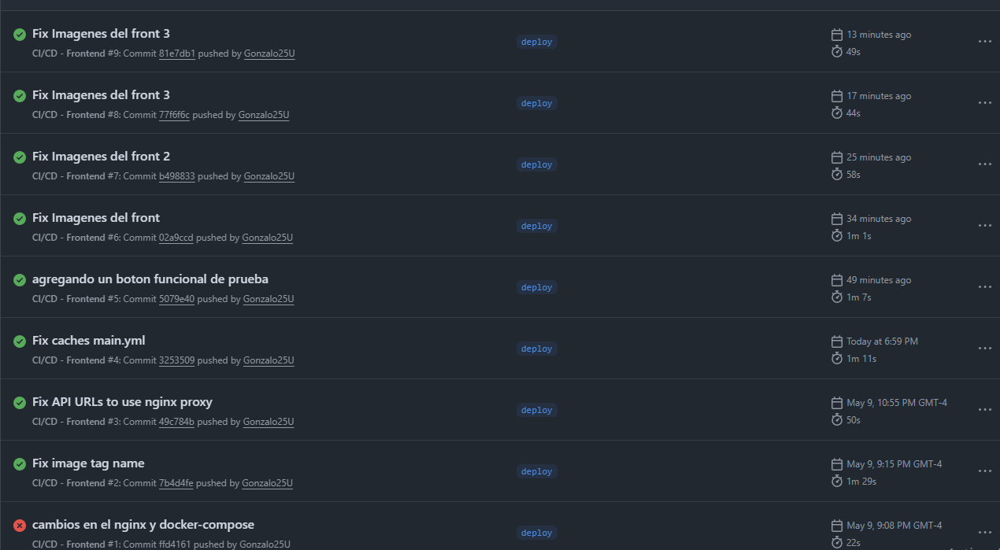

# Front-Pipeline-CI-CD-evaluacion-2

Frontend de la aplicación de gestión de ventas y despachos, desarrollado con **React + Vite** y desplegado mediante un pipeline CI/CD en una instancia EC2 de AWS.

---

## 📸 Pipeline en funcionamiento



## 🌐 Frontend desplegado en AWS


---

## 🛠️ Tecnologías utilizadas

- React 18 + Vite
- Nginx Alpine (servidor de producción)
- Docker + Docker Compose
- GitHub Actions (CI/CD)
- AWS EC2

---

## 📁 Estructura de archivos Docker

```
Front-Pipeline-CI-CD-evaluacion-2/
├── public/
│   ├── apple.png
│   ├── hyperx.png
│   └── logitech.png
├── src/
│   └── ...
├── Dockerfile
├── nginx.conf
├── docker-compose.yml
└── .github/
    └── workflows/
        └── ci-cd.yml
```

---

## 🐳 Dockerfile

Se utilizó un **multi-stage build** con dos etapas:

1. **Stage 1 - Build:** usa la imagen `node:20-alpine` para instalar dependencias y compilar el proyecto con `npm run build`. Vite genera el output en la carpeta `/dist`.

2. **Stage 2 - Runner:** usa la imagen `nginx:alpine` para servir los archivos estáticos generados. Es más liviana y eficiente que correr Node en producción para una SPA.

```dockerfile
FROM node:20-alpine AS builder
WORKDIR /app
COPY package*.json ./
RUN npm ci
COPY . .
RUN npm run build

FROM nginx:alpine AS runner
RUN rm /etc/nginx/conf.d/default.conf
COPY nginx.conf /etc/nginx/conf.d/app.conf
COPY --from=builder /app/dist /usr/share/nginx/html
EXPOSE 80
CMD ["nginx", "-g", "daemon off;"]
```

---

## ⚙️ nginx.conf

Se configuró Nginx con tres funciones principales:

1. **Servir la SPA:** fallback a `index.html` para que `react-router-dom` funcione al refrescar la página.
2. **Proxy inverso hacia los backends:** las rutas `/api/ventas/` y `/api/despachos/` se redirigen a las IPs privadas de la EC2 `app`.
3. **Caché de assets estáticos:** los archivos con hash generados por Vite se cachean por 1 año.

El proxy inverso fue clave para que el frontend pudiera comunicarse con los backends en la subred privada sin exponer sus IPs directamente al navegador.

---

## 🐙 docker-compose.yml

Se definió un servicio `frontend` con:
- Imagen publicada en Docker Hub: `gonzalo25u/frontend:latest`
- Puerto `80:80`
- **Named volume** para logs de Nginx: `nginx_logs:/var/log/nginx`

### Justificación del volumen

Se eligió **named volume** sobre bind mount porque:
- Docker gestiona la ubicación automáticamente sin depender de rutas del host
- Es más portable entre distintos sistemas operativos
- El ciclo de vida del volumen es independiente del contenedor

---

## 🔄 Pipeline CI/CD

El pipeline se activa con cada push a la rama `deploy` y tiene dos jobs:

### Job 1: Build & Push
1. Checkout del código
2. Login a Docker Hub con secrets
3. Configuración de Docker Buildx
4. Build y push de la imagen con dos tags:
   - `:latest` → siempre apunta a la versión más reciente
   - `:<sha-commit>` → permite rollback a una versión específica

### Job 2: Deploy en EC2
1. Configuración de llave SSH
2. Copia del `docker-compose.yml` a la EC2 `web`
3. Conexión SSH a la EC2 y ejecución de `docker compose pull` y `docker compose up -d`

---

## 🔐 Secrets configurados en GitHub

| Secret | Descripción |
|---|---|
| `DOCKERHUB_USERNAME` | Usuario de Docker Hub |
| `DOCKERHUB_TOKEN` | Token de acceso Docker Hub |
| `EC2_SSH_KEY` | Llave privada SSH (.pem) |
| `EC2_USER` | Usuario de la EC2 (`ec2-user`) |
| `EC2_WEB_HOST` | IP pública de la EC2 web |

---

## ⚠️ Problemas encontrados y soluciones

### 1. Nombre de imagen con mayúsculas
**Problema:** el tag de la imagen en el pipeline usaba el nombre del repositorio de GitHub (`gonzalo25u/Front-Pipeline-CI-CD-evaluacion-2-`) que contiene mayúsculas, lo cual Docker no permite.

**Solución:** se hardcodeó el nombre de la imagen como `gonzalo25u/frontend:latest` en el `ci-cd.yml` y `docker-compose.yml`.

---

### 2. URLs hardcodeadas con IPs locales
**Problema:** el código fuente del frontend tenía las URLs de los backends hardcodeadas con IPs locales del desarrollador original (`192.168.0.30` y `192.168.3.20`), por lo que fallaban en producción.

**Solución:** se reemplazaron las URLs absolutas por rutas relativas (`/api/ventas/` y `/api/despachos/`) que Nginx redirige hacia los backends mediante proxy inverso.

Archivos modificados:
- `TableCompras.jsx`
- `TableDespachos.jsx`
- `FormDespacho.jsx`
- `FormCierreDespacho.jsx`

---

### 3. Imágenes externas bloqueadas por CORS
**Problema:** el componente `Reviews.jsx` cargaba logos desde `seeklogo.com`, que bloquea solicitudes desde otros dominios con el error `ERR_BLOCKED_BY_RESPONSE.NotSameOrigin`.

**Solución:** se descargaron las imágenes y se guardaron localmente en la carpeta `public/` del proyecto, cambiando las URLs externas por rutas locales (`/apple.png`, `/hyperx.png`, `/logitech.png`).

---

### 4. Contenedor desactualizado en EC2
**Problema:** después de cada deploy el contenedor en la EC2 seguía usando la imagen anterior porque el `docker-compose.yml` en la instancia tenía el nombre incorrecto de la imagen.

**Solución:** se corrigió el nombre de la imagen directamente en la EC2 con `sed` y se forzó la recreación del contenedor con `docker-compose up -d --force-recreate`.

---

## 🚀 Instrucciones para ejecutar localmente

```bash
# Clonar el repositorio
git clone https://github.com/gonzalo25u/Front-Pipeline-CI-CD-evaluacion-2-.git

# Instalar dependencias
npm install

# Ejecutar en desarrollo
npm run dev

# Construir imagen Docker
docker-compose up -d --build
```