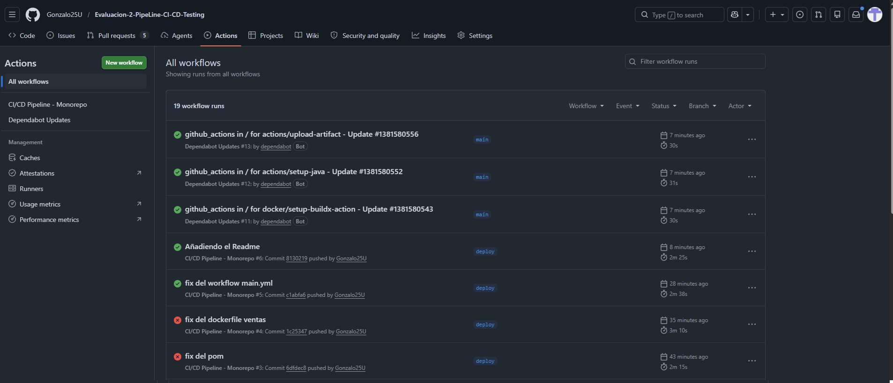
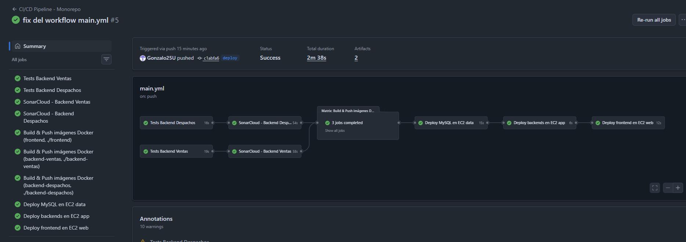

# Evaluacion-2-PipeLine-CI-CD-Testing

Monorepo que integra el frontend y ambos backends del sistema de gestión de ventas y despachos, con un pipeline CI/CD completo, pruebas unitarias, análisis de código con SonarCloud y gestión automática de dependencias con Dependabot.

---

## 🛠️ Tecnologías utilizadas

- React 18 + Vite (Frontend)
- Spring Boot 3.4.4 + Java 17 (Backends)
- MySQL 8.0 (Base de datos)
- Docker + Docker Compose
- GitHub Actions (CI/CD)
- JUnit 5 + Mockito (Pruebas unitarias)
- JaCoCo (Cobertura de código)
- SonarCloud (Análisis de calidad)
- Dependabot (Gestión de dependencias)
- AWS EC2 (Infraestructura)

---

## 📁 Estructura del monorepo

```
monorepo/
├── backend-ventas/
│   ├── src/
│   │   ├── main/java/com/citt/
│   │   └── test/java/com/citt/    ← tests JUnit
│   ├── pom.xml
│   ├── Dockerfile
│   └── docker-compose.yml
├── backend-despachos/
│   ├── src/
│   │   ├── main/java/com/citt/
│   │   └── test/java/com/citt/    ← tests JUnit
│   ├── pom.xml
│   ├── Dockerfile
│   └── docker-compose.yml
├── frontend/
│   ├── src/
│   ├── public/
│   ├── Dockerfile
│   ├── nginx.conf
│   └── docker-compose.yml
├── data/
│   └── docker-compose.yml         ← MySQL para EC2 data
├── docker-compose.yml             ← desarrollo local (todo junto)
├── sonar-project.properties
├── .env.example
└── .github/
    ├── dependabot.yml
    └── workflows/
        └── ci-cd.yml
```

---

## 🔄 Pipeline CI/CD

El pipeline se activa con cada push a la rama `deploy` y ejecuta **7 jobs en orden**:

```
test-ventas ──┐
              ├──→ sonar-ventas ──┐
test-despachos┘                  ├──→ build-and-push → deploy-data → deploy-app → deploy-web
              └──→ sonar-despachos┘
```

---

## 🔄 Pipeline CI/CD





## 📈 Pipeline CI/CD Vista interna 




### Job 1 y 2 — Pruebas unitarias
Ejecuta los tests unitarios de cada backend con Maven. Se usa `-Dtest` para correr únicamente los tests con Mockito, evitando los tests de integración que requieren conexión a MySQL. El reporte de cobertura generado por JaCoCo se publica como artefacto descargable en GitHub Actions.

### Job 3 y 4 — Análisis SonarCloud
Solo corre si los tests pasaron. Compila el proyecto, genera el reporte de cobertura y lo envía a SonarCloud para análisis de calidad de código, bugs y code smells.

### Job 5 — Build & Push Docker Hub
Solo corre si SonarCloud pasó. Construye las 3 imágenes Docker en paralelo usando una matrix y las publica en Docker Hub con dos tags:
- `:latest` → siempre apunta a la versión más reciente
- `:<sha-commit>` → permite rollback a una versión específica

### Job 6 — Deploy MySQL en EC2 data
Copia el `docker-compose.yml` de MySQL a la EC2 `data` usando **doble jump host** (web → app → data), ya que `data` no tiene acceso SSH directo desde internet. Escribe el `.env` con las credenciales desde los secrets de GitHub y levanta el contenedor.

### Job 7 — Deploy backends en EC2 app
Copia los `docker-compose.yml` de ambos backends a la EC2 `app` usando **jump host** via EC2 `web`. Escribe el `.env` con las credenciales de MySQL y levanta los contenedores en la misma instancia.

### Job 8 — Deploy frontend en EC2 web
Copia el `docker-compose.yml` del frontend a la EC2 `web` y levanta el contenedor. Esta instancia tiene acceso SSH directo desde internet, por lo que no necesita jump host.

---

## 🧪 Pruebas unitarias

Se implementaron tests unitarios con **JUnit 5 + Mockito** para los servicios de ambos backends. Los tests usan el patrón **Mock** para simular el repositorio de base de datos, permitiendo ejecutarlos sin necesidad de una conexión real a MySQL.

### VentaServiceImplTest
Cubre los métodos del servicio de ventas:
- `findAllVentas` — lista vacía y con datos
- `saveVenta` — guarda y retorna correctamente
- `findById` — retorna la venta o lanza `VentaNotFoundException`
- `updateVenta` — actualiza campos, lanza excepción si no existe, no modifica dirección si viene vacía
- `deleteVenta` — elimina correctamente o lanza excepción si no existe

### DespachoServiceImplTest
Cubre los métodos del servicio de despachos:
- `findAllDespachos` — lista vacía y con datos
- `saveDespacho` — guarda y retorna correctamente
- `findById` — retorna el despacho o lanza `DespachoNotFoundException`
- `updateDespacho` — actualiza todos los campos o lanza excepción
- `deleteDespacho` — elimina correctamente o lanza excepción

### Cobertura de código
Se usa **JaCoCo** para medir la cobertura de los tests. El reporte se genera automáticamente en el pipeline y se publica como artefacto descargable en GitHub Actions bajo el nombre `cobertura-ventas` y `cobertura-despachos`.

---

## 🔍 SonarCloud

SonarCloud analiza la calidad del código de ambos backends en cada push a `deploy`. El análisis incluye:

- **Bugs** — errores potenciales en el código
- **Vulnerabilidades** — problemas de seguridad
- **Code smells** — código que puede mejorarse
- **Cobertura** — porcentaje de código cubierto por tests
- **Duplicaciones** — código duplicado

Los proyectos en SonarCloud son:
- `gonzalo25u_backend-ventas`
- `gonzalo25u_backend-despachos`

---

## 🤖 Dependabot

Dependabot revisa automáticamente las dependencias del proyecto cada **lunes** y abre Pull Requests cuando encuentra versiones más nuevas. Está configurado para los siguientes ecosistemas:

| Ecosistema | Directorio | Frecuencia |
|---|---|---|
| Maven | `/backend-ventas` | Semanal (lunes) |
| Maven | `/backend-despachos` | Semanal (lunes) |
| npm | `/frontend` | Semanal (lunes) |
| Docker | `/backend-ventas` | Semanal |
| Docker | `/backend-despachos` | Semanal |
| Docker | `/frontend` | Semanal |
| GitHub Actions | `/` | Semanal |

Los PRs creados por Dependabot incluyen etiquetas como `dependencies`, `frontend`, `backend-ventas` o `backend-despachos` para identificarlos fácilmente.

---

## 🎯 Trazabilidad y calidad del código

### Trazabilidad

Cada imagen Docker publicada en Docker Hub tiene dos tags:
- `:latest` — apunta siempre a la versión más reciente
- `:<sha-commit>` — vincula la imagen exactamente al commit de GitHub que la generó

Esto permite saber en todo momento qué versión del código está corriendo en producción. Si algo falla, se puede hacer rollback a una versión anterior ejecutando:

```bash
docker-compose pull gonzalo25u/backend-ventas:<sha-anterior>
docker-compose up -d
```

Además, cada ejecución del pipeline queda registrada en GitHub Actions con su fecha, rama, commit y resultado. Esto genera un historial completo de todos los despliegues realizados.

Los reportes de cobertura de JaCoCo se guardan como artefactos descargables en cada ejecución del pipeline, permitiendo comparar la evolución de la cobertura entre versiones.

---

### Calidad del código

La calidad se garantiza mediante tres capas:

**Capa 1 — Pruebas unitarias (JUnit 5 + Mockito):** cada push a `deploy` ejecuta los tests antes de construir las imágenes. Si un test falla, el pipeline se detiene y no se despliega nada. Esto evita que código con errores llegue a producción.

**Capa 2 — Cobertura de código (JaCoCo):** mide qué porcentaje del código está cubierto por tests. El reporte se envía a SonarCloud y se publica como artefacto en GitHub Actions para seguimiento.

**Capa 3 — Análisis estático (SonarCloud):** analiza el código en busca de bugs, vulnerabilidades, code smells y duplicaciones. Solo si SonarCloud pasa se procede a construir y desplegar las imágenes Docker. Esto asegura que el código que llega a producción cumple estándares mínimos de calidad.

**Dependabot** complementa esto manteniendo las dependencias actualizadas automáticamente, reduciendo el riesgo de vulnerabilidades conocidas en librerías de terceros.

El flujo completo garantiza que ningún cambio llega a producción sin haber pasado por tests, análisis de cobertura y análisis de calidad estático.

---

## 🔐 Secrets configurados en GitHub

| Secret | Descripción |
|---|---|
| `DOCKERHUB_USERNAME` | Usuario de Docker Hub |
| `DOCKERHUB_TOKEN` | Token de acceso Docker Hub |
| `EC2_SSH_KEY` | Llave privada SSH (.pem) |
| `EC2_USER` | Usuario de las EC2 (`ec2-user`) |
| `EC2_WEB_HOST` | IP pública de EC2 web |
| `EC2_APP_HOST` | IP privada de EC2 app |
| `EC2_DATA_HOST` | IP privada de EC2 data |
| `SONAR_TOKEN` | Token de SonarCloud |
| `DB_NAME` | Nombre de la base de datos |
| `DB_USERNAME` | Usuario MySQL |
| `DB_PASSWORD` | Password MySQL |
| `MYSQL_ROOT_PASSWORD` | Password root MySQL |

---

## 🚀 Instrucciones para ejecutar localmente

```bash
# Clonar el repositorio
git clone https://github.com/gonzalo25u/Evaluacion-2-PipeLine-CI-CD-Testing.git

# Copiar variables de entorno
cp .env.example .env
# Editar .env con tus credenciales

# Levantar todos los servicios
docker-compose up -d --build

# Ver logs
docker-compose logs -f
```

---

## 📈 Mejoras respecto a la versión anterior

La versión anterior del proyecto consistía en **3 repositorios separados**, cada uno con su propio pipeline independiente. Esta versión introduce las siguientes mejoras:

**Monorepo:** todos los servicios en un solo repositorio, lo que facilita la gestión de cambios que afectan a múltiples servicios y evita la duplicación de configuración.

**Pipeline unificado:** un solo `ci-cd.yml` orquesta el despliegue completo en orden — primero los tests, luego el análisis de calidad, luego el build y finalmente el deploy en cada instancia. En la versión anterior cada repo tenía su pipeline independiente sin coordinación entre ellos.

**Pruebas unitarias:** se agregaron tests con JUnit 5 + Mockito para los servicios de ambos backends, con reporte de cobertura JaCoCo. La versión anterior no tenía tests.

**SonarCloud:** se integró análisis automático de calidad de código en el pipeline. La versión anterior no tenía análisis de código.

**Dependabot:** actualización automática de dependencias semanalmente. La versión anterior no tenía gestión automática de dependencias.

**Deploy automatizado de MySQL:** el pipeline ahora despliega automáticamente el contenedor de MySQL en la EC2 `data` usando doble jump host. En la versión anterior esto se hacía manualmente.